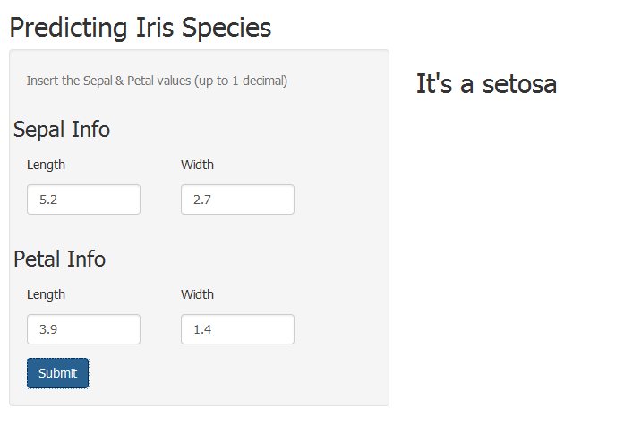

An Iris Species Predictor App
========================================================
author: Max Almodovar
date: April 21st, 2016

Objective
========================================================

Let me introduce you the **Iris Species Predictor App**:

- Shiny Server Link: (poner link Shiny)
- [GitHub Link] (https://github.com/maxal1986/Iris-Species-Predictor-App)

This app uses the following libraries and datasets:


```r
library(shiny)

data(iris)
```

The Iris Data Set
========================================================
If you take a look at the Iris dataset, we have the following variables 

```
[1] "Sepal.Length" "Sepal.Width"  "Petal.Length" "Petal.Width" 
[5] "Species"     
```

In particular, we want to predict the variable "Species" that can take the following values:

```
    setosa versicolor  virginica 
        50         50         50 
```


The Prediction Model
========================================================
We will use the `caret` package to create a simple Random Forest Model

```r
set.seed(12345)
inTrain <- createDataPartition(y = iris$Species, p = 0.6, list = FALSE)
myTraining <- iris[inTrain, ]
myTesting <- iris[-inTrain, ]

modFit <- train(Species ~ ., method = "rf", data = myNewTraining)
```

The result of this model is stored in a `rda` file which will be used in our server.

The Look & Feel
========================================================


The user can enter the values of the Iris which is being measured with up to 1 decimal. Once the "Submit" button is clicked the system will predict with Iris Species is.
